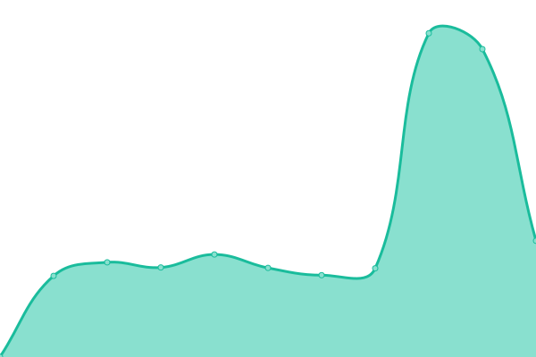

# [📈 Live Status](https://Delamcode.github.io/UpptimeBot): <!--live status--> **🟥 Complete outage**

This repository contains the open-source uptime monitor and status page for [Delamcode](https://Delamcode.github.io/UpptimeBot), powered by [Upptime](https://github.com/upptime/upptime).

With [Upptime](https://upptime.js.org), you can get your own unlimited and free uptime monitor and status page, powered entirely by a GitHub repository. We use [Issues](https://github.com/Delamcode/UpptimeBot/issues) as incident reports, [Actions](https://github.com/Delamcode/UpptimeBot/actions) as uptime monitors, and [Pages](https://Delamcode.github.io/UpptimeBot) for the status page.

<!--start: status pages-->
<!-- This summary is generated by Upptime (https://github.com/upptime/upptime) -->
<!-- Do not edit this manually, your changes will be overwritten -->
<!-- prettier-ignore -->
| URL | Status | History | Response Time | Uptime |
| --- | ------ | ------- | ------------- | ------ |
|  [Immich Public Proxy](https://public.end-eagle.ts.net) | 🟥 Down | [immich-public-proxy.yml](https://github.com/Delamcode/UpptimeBot/commits/HEAD/history/immich-public-proxy.yml) | 

 1175ms
     
 | 

<a href="https://Delamcode.github.io/UpptimeBot/history/immich-public-proxy">35.37%</a>
    

<!--end: status pages-->

[**Visit our status website →**](https://Delamcode.github.io/UpptimeBot)

## 📄 License

- Powered by: [Upptime](https://github.com/upptime/upptime)
- Code: [MIT](./LICENSE) © [Anand Chowdhary](https://anandchowdhary.com), supported by [Pabio](https://pabio.com)
- Data in the `./history` directory: [Open Database License](https://opendatacommons.org/licenses/odbl/1-0/)
